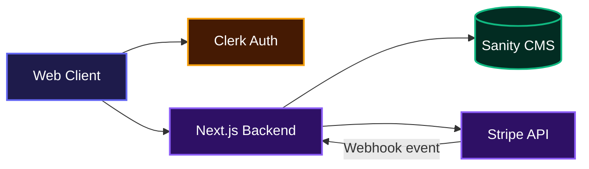
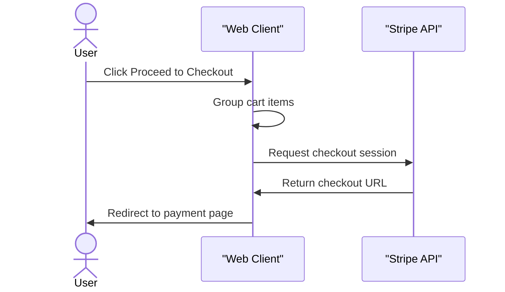
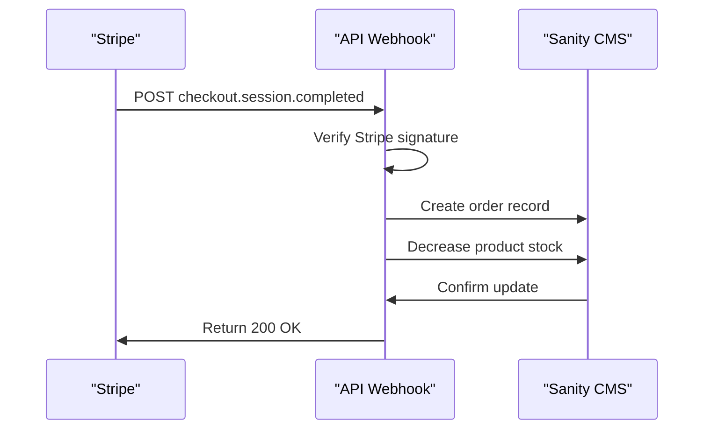

# Shopcart

Shopcart provides teams with a fully functional e-commerce storefront integrated with secure payment processing and content management. It allows users to browse products, manage their shopping carts, authenticate securely, and complete purchases while automatically keeping inventory synchronized.

## System Architecture



## Features

### Product Browsing and Discovery
Users can explore a catalog of products filtered by categories, brands, and price ranges. The interface includes dynamic search capabilities and specialized sections for hot deals and latest blog posts.

### State Management for Cart and Favorites
The application utilizes a persistent local store to maintain user shopping carts and wishlist items across sessions. It accurately calculates subotals, applies discounts, and tracks product quantities against available inventory.

### Secure Checkout Processing
The platform connects with Stripe to handle secure payment sessions. It groups cart items, attaches necessary metadata, and redirects users to a hosted payment page.



### Automated Order and Inventory Synchronization
A dedicated webhook endpoint listens for successful payment events. Once a payment clears, the backend automatically creates an order record in the content management system and decrements the purchased quantities from available stock.



## Technologies Used

| Technology | Purpose |
| :--- | :--- |
| **Next.js** | React framework for server-side rendering and routing |
| **TypeScript** | Static typing for JavaScript |
| **Tailwind CSS** | Utility-first styling |
| **Zustand** | State management for cart and favorites |
| **Clerk** | User authentication and session management |
| **Sanity** | Headless CMS for product and order data |
| **Stripe** | Payment processing and checkout |
| **Shadcn UI** | Accessible component primitives |

## Installation

Follow these steps to set up the project locally.

1. Clone the repository:
```bash
git clone https://github.com/EbubeStrong/new-project2.git
cd new-project2
```

2. Install dependencies:
```bash
npm install
```

3. Configure environment variables. Create a `.env.local` file in the root directory with the following keys:
```bash
NEXT_PUBLIC_CLERK_PUBLISHABLE_KEY=pk_test_...
CLERK_SECRET_KEY=sk_test_...
NEXT_PUBLIC_SANITY_PROJECT_ID=your_project_id
NEXT_PUBLIC_SANITY_DATASET=production
SANITY_API_TOKEN=sk_...
STRIPE_SECRET_KEY=sk_test_...
STRIPE_WEBHOOK_SECRET=whsec_...
NEXT_PUBLIC_BASE_URL=http://localhost:3000
```

4. Start the development server:
```bash
npm run dev
```

## Usage

Once the application is running, navigate to the local server address in your browser. Users can freely browse the shop and view individual product pages. To add items to the cart or wishlist, users must sign in via the authentication modal. 

When ready to purchase, navigating to the cart page will display an order summary. Clicking the checkout button transitions the user to the Stripe checkout environment to finalize the order securely.

## API Documentation

### POST /api/webhook
**Description**: Handles incoming webhook events from Stripe. Specifically, it listens for the `checkout.session.completed` event to securely generate a new order in Sanity and update the available stock for the purchased products.

**Headers Required**:
- `stripe-signature`: Used to verify the authenticity of the webhook payload.

**Request**:
This endpoint expects a raw text payload directly from Stripe containing the event data.

```json
{
  "id": "evt_1...",
  "type": "checkout.session.completed",
  "data": {
    "object": {
      "id": "cs_test_...",
      "amount_total": 5000,
      "currency": "usd",
      "metadata": {
        "orderNumber": "12345",
        "customerName": "John Doe",
        "customerEmail": "john@example.com"
      }
    }
  }
}
```

**Response**:
```json
{
  "received": true
}
```

**Errors**:
- 400 Bad Request: Triggered if the signature is missing, if the signature verification fails, or if the webhook secret is missing from the environment.
- 400 Bad Request: Triggered if the order creation process fails within Sanity.

## Contributing

We welcome contributions to this project. To contribute, please fork the repository, create a new branch for your feature or bug fix, and submit a pull request with a clear description of the changes made. Ensure all code follows the established formatting and passes existing build checks before submitting.

## Author Info

* LinkedIn: [https://linkedin.com/in/AbrahamSamuel567](https://linkedin.com/in/AbrahamSamuel567)
* X (Twitter): [https://x.com/ebubestrong21](https://x.com/ebubestrong21)

## Badges

[](https://nextjs.org/)
[](https://reactjs.org/)
[](https://www.typescriptlang.org/)
[](https://tailwindcss.com/)
[](https://stripe.com/)
[](https://sanity.io/)